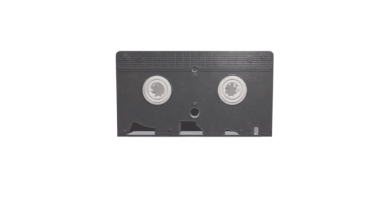

# Remotion .glb demo

A repository showing how to import .glb files in Remotion. Ask React Three Fiber questions elsewhere, we (probably) have no idea!

<p align="center">
    
</p>

- [Remotion documentation](https://remotion.dev)
- [React Three Fiber documentation](https://docs.pmnd.rs/react-three-fiber)
- [@remotion/three documentation](http://remotion.dev/docs/three)

This example features a phone with a screen. You can easily switch out the video and change a series of parameters, like size, color, aspect ratio, corner radius etc. of the phone.

You can also simply delete everything inside the canvas to start off with your own 3D project.

## Commands

**Install Dependencies**

```console
npm install
```

**Start Preview**

```console
npm start
```

**Render MP4 video**

```console
npm run build
```

**Upgrade Remotion**

```console
npm run upgrade
```

## Docs

Get started with Remotion by reading the [fundamentals page](https://www.remotion.dev/docs/the-fundamentals).

## Issues

Found an issue with Remotion? [File an issue here](https://github.com/JonnyBurger/remotion/issues/new).

## License

Note that for some entities a Remotion company license is needed.  
Read [the Remotion License here](https://github.com/JonnyBurger/remotion/blob/main/LICENSE.md).

The content of this template is licensed under MIT.
